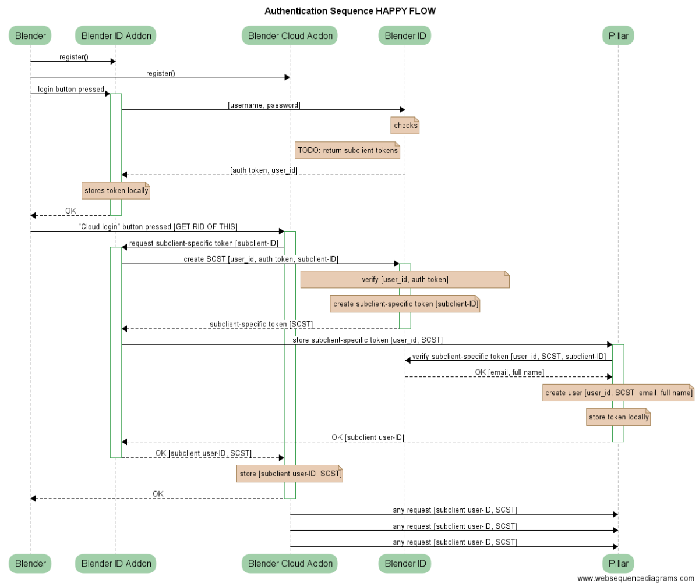

# Authentication
The core of the authentication system is based on Pillar Server. That's where
the user accounts are. The authentication flow can happen on a dedicated
endpoint (local authentication) or via a 3rd party OAuth service. This is a
more complex scenario, which involves setting up Pillar Server and Pillar Web
so that they act as a single OAuth client.

## Local authentication

## OAuth authentication

## OAuth subclient authentication


## How do we generate a token?
The generation of a token can be triggered in a couple of ways after a correct user identification:

* OAuth token obtained via Pillar Web
* Local account (starting from an encrypted password)

## Token validation
On the  *Pillar Server* level, since we are providing a stateless RESTful API, we  authenticate using a base64 encoded token in the `header` of each request.
We check like this:

```py
@app.before_request
def validate_token_at_every_request():
    validate_token()
```

Where `validate_token()` validates the token provided in the request and 
populates the current_user flask.g object, so that permissions and access to 
a resource can be defined from it.

When the token is successfully validated, we set `g.current_user` to contain 
the user information, otherwise it is set to None.

This happens at every request.

