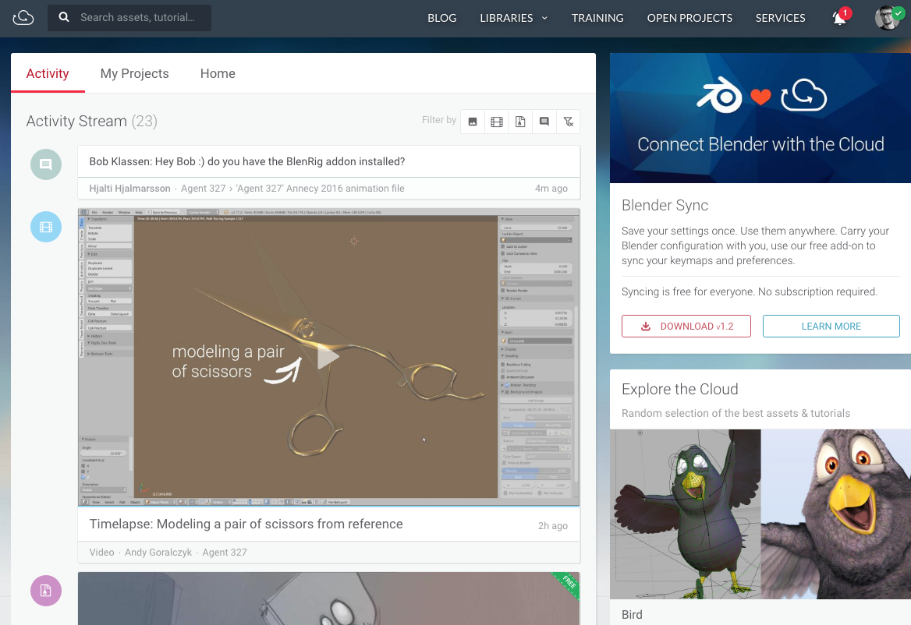

# Welcome to Pillar

Pillar is a framework used to build the custom CMS that runs on the
[Blender Cloud](https://blender.cloud). Pillar is Free and Open Source software,
developed at the Blender Institute.

Currently Pillar is used as publishing platform to share production assets,
documentation and video training. Other possible uses include production/shot
management and render management.

A roadmap with the planning of the upcoming features is available in the
[Development section](development/roadmap.md).
